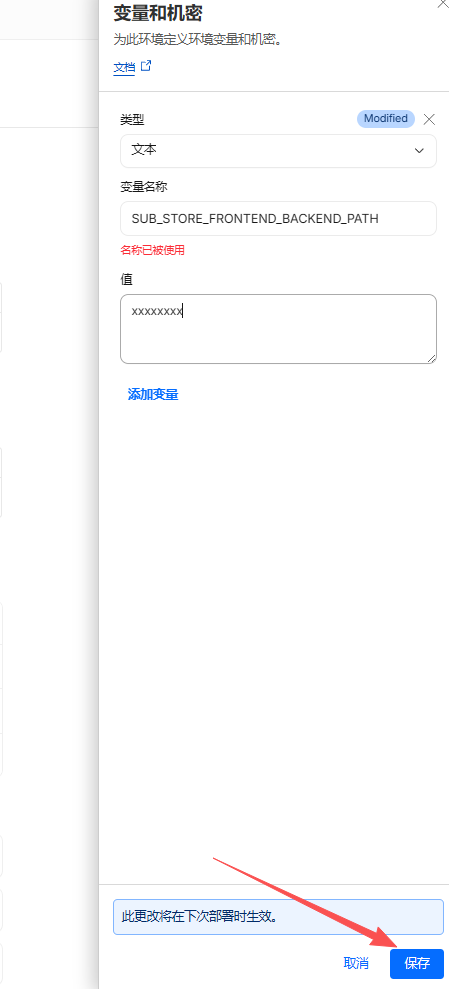

<div align="center">
<br>

<br>
<br>
<h2 align="center">Sub-Store Workers</h2>
</div>

<p align="center" color="#6a737d">
Sub-Store 后端的 Cloudflare Workers 移植版
</p>

<p align="center">
<a href="https://deploy.workers.cloudflare.com/?url=https://github.com/Yu9191/sub-store-workers">

</a>
<br><br>
<a href="mydocs/codemap/project-overview.md">

</a>
</p>

> **注意**：一键部署按钮**仅供参考**，由于项目需要本地构建（esbuild + Sub-Store 源码），实际无法直接通过此按钮完成部署。请参照下方[手动部署步骤](#部署)。
>
> **自动部署**：本仓库已内置 GitHub Actions 工作流，每天自动检测上游 Sub-Store 更新并部署到 Cloudflare。只需配置 Secrets 即可开启，无需本地操作。详见 [GitHub Actions 自动同步上游](#同步更新)。

## 简介

将 [Sub-Store](https://github.com/sub-store-org/Sub-Store) 后端部署到 Cloudflare Workers / Pages，无需服务器，免费使用。

- **零服务器**：运行在 Cloudflare 边缘网络
- **KV 持久化**：数据存储在 Cloudflare KV
- **完整功能**：复用原始后端全部业务逻辑（订阅管理、格式转换、下载、预览等）
- **预编译解析器**：peggy 文法在构建时编译，避免运行时 eval()

## 目录

- [部署](#部署)（核心流程，建议从这里开始）
- [进阶配置 / 平台说明](#进阶配置--平台说明)（推送、环境变量、本地开发等，已折叠）
- [FAQ](#faq)
- [同步更新](#同步更新)
- [Surge 面板脚本](#surge-面板脚本)
- [致谢](#致谢) ｜ [许可证](#许可证)

<details>
<summary><b>架构说明</b>（如果你只想部署可跳过）</summary>

```
sub-store-workers/src/        ← Workers 适配层（6 个文件）
Sub-Store/backend/src/        ← 原始后端源码（直接复用）
esbuild.js                    ← 构建脚本，通过插件桥接两者
```

仅替换了平台相关层，核心逻辑零修改：

| Workers 文件 | 作用 |
|---|---|
| `vendor/open-api.js` | KV 替换 fs，fetch 替换 undici |
| `vendor/express.js` | Workers fetch handler 替换 Node express |
| `core/app.js` | 导入 Workers 版 OpenAPI |
| `utils/env.js` | 环境检测 |
| `restful/token.js` | 允许 Workers 签发 token |
| `index.js` | Workers 入口 |

更详细的项目总图见 [`mydocs/codemap/project-overview.md`](mydocs/codemap/project-overview.md)。

</details>

## 部署

> 部署总览：**1.准备 → 2.上传 Workers/Pages → 3.设密码（必做）→ 4.连接前端**
>
> 为什么两个都要部？`*.workers.dev` 在国内被 GFW 封锁，`*.pages.dev` 走 Cloudflare CDN 通常可直连。
>
> - **有自定义域名**：只用 Workers 即可
> - **无自定义域名**：Pages 对外提供 API，Workers 在后台跑 Cron。

### 1. 克隆仓库

```bash
# 目录结构必须如下：
# parent/
#   ├── Sub-Store/          ← 原始后端源码
#   └── sub-store-workers/  ← 本项目

git clone https://github.com/sub-store-org/Sub-Store.git
git clone https://github.com/Yu9191/sub-store-workers.git

cd sub-store-workers
npm install
```

### 2. 登录 Cloudflare

```bash
npx wrangler login
```

### 3. 创建 KV 命名空间

```bash
npx wrangler kv namespace create SUB_STORE_DATA
```

将返回的 `id` 填入 `wrangler.toml`：

```toml
[[kv_namespaces]]
binding = "SUB_STORE_DATA"
id = "你的KV命名空间ID"
```

### 4. 构建 & 部署

**两者都需要部署：**

| 部署方式 | 域名 | 用途 |
|---|---|---|
| **Workers** | `*.workers.dev` 或自定义域名 | API + Cron 定时同步 |
| **Pages** | `*.pages.dev` | API（国内可直连） |

> ⚠️ **执行下方部署命令前，请先确认已完成「1. 克隆仓库」「2. 登录 Cloudflare」「3. 创建 KV 命名空间」三步**，并完整阅读下文「5. 连接前端」「6. API 鉴权」两节。**部署完未设密码前 Worker 是公开的，任何人都能管理你的数据。**

```bash
# Workers 部署（含 Cron Triggers）
npm run deploy

# Pages 部署（国内可用，一条命令）
npm run deploy:pages
```

> **强烈建议部署后立即设置鉴权密码**，否则任何人都能管理你的 Sub-Store 数据：
>
> ```bash
> # Windows
> npm run rotate-secret
>
> # Linux / macOS
> npm run rotate-secret:sh
> ```
>
> 脚本会生成随机 URL-safe 密码，写入 Cloudflare Worker Secret，并复制到剪贴板。详细说明见下文“6. API 鉴权”。

> Pages 部署完成后还需要在 Cloudflare Dashboard 中：
>
> 1. 绑定 KV 命名空间 `SUB_STORE_DATA`
> 2. 设置鉴权密码 Secret `SUB_STORE_FRONTEND_BACKEND_PATH`
>
> 详细图文步骤见下文 [6. API 鉴权 → 方式 A.2 Pages 端](#6-api-鉴权强烈建议--已在第-4-步完成可跳过)。配置完成后必须再跑一次 `npm run deploy:pages` 让绑定生效。

<details>
<summary><b>自定义域名注意事项（如果你绑定了自有域名）</b></summary>

- SSL/TLS 加密模式必须设为 **Full**（Cloudflare Dashboard → 域名 → SSL/TLS → 概述）
- Cloudflare 免费 SSL 证书只覆盖**一级子域名**（`*.example.com`），不支持多级子域名（如 `a.b.example.com`）
  - 正确 `substore.example.com`
  - 错误 `substore.sub.example.com`（会导致 `ERR_CONNECTION_CLOSED`）

</details>

### 5. 连接前端

打开 [Sub-Store 前端](https://sub-store.vercel.app)，后端地址格式：

```text
你的域名/你的密码
```

例如：

```text
https://sub-store-workers.your.workers.dev/aBc123XyZ
https://sub-store.your.pages.dev/aBc123XyZ
```

> 注意：**末尾的 `/密码` 不能省略**，否则 `/api/...` 会全部 401。

部署完后访问 `https://你的域名/你的密码/api/utils/worker-status`，应返回：

```json
{ "kv": { "bound": true }, "auth": { "backendPathConfigured": true } }
```

### 6. API 鉴权（强烈建议 / 已在第 4 步完成可跳过）

> 默认 API 无密码保护。**不设密码任何人都能管理你的订阅**。第 4 步执行 `npm run rotate-secret` 已经设过的话，可以跳过本节。

> 推荐使用 **Worker / Pages Secret**（加密存储）。**不要**写到 `wrangler.toml [vars]` 里——那里是明文，会随 commit 泄漏，并且 `wrangler deploy` 会用它覆盖同名 Secret，与下面的流程冲突。

#### 方式 A（推荐）：使用 Cloudflare Secret

##### A.1 Workers 端（项目自带脚本）

仓库提供了密钥轮换脚本，一行命令完成生成 + 写入 + 复制到剪贴板：

```bash
# Windows
npm run rotate-secret

# Linux / macOS
npm run rotate-secret:sh
```

脚本会：

- 用加密随机数生成 32 位 URL-safe 密码
- 自动加 `/` 前缀
- 通过管道写入 Cloudflare Worker Secret `SUB_STORE_FRONTEND_BACKEND_PATH`（密码不落盘、不显示在屏幕、不进入 shell 历史）
- 复制到剪贴板，方便粘贴到前端配置

执行成功后，请同步更新：

1. 前端后端地址：`https://xxx.workers.dev<剪贴板里的新密码>`
2. 如果使用 GitHub Actions 自动部署，还要更新仓库 Secret（如 `SUB_STORE_PASSWORD_VALUE`）

> 用完后建议清空剪贴板：
> - PowerShell：`Set-Clipboard -Value $null`
> - macOS：`pbcopy </dev/null`
> - Linux：`wl-copy --clear` 或 `xsel --clipboard --clear`

也可以手动设置（提示输入时填带 `/` 开头的密码）：

```bash
npx wrangler secret put SUB_STORE_FRONTEND_BACKEND_PATH
```

##### A.2 Pages 端（在 Dashboard 配置）

`wrangler.toml` 的 `[[kv_namespaces]]` 与 `[vars]` **只对 Workers 生效**。Pages 项目必须在 Cloudflare Dashboard 单独绑定 KV 与设置密码，否则 API 会因为缺少 KV 而 500，且任何人都可访问管理 API。

**① 进入 Workers & Pages，点击 sub-store 项目**


**② 进入 设置 → 绑定，点击 + 添加 KV 命名空间**


**③ 选择 KV 命名空间**


**④ 变量名填 `SUB_STORE_DATA`，选择对应 KV，保存**


**⑤ 进入 设置 → 变量和机密，点击 + 添加**


**⑥ 变量名填 `SUB_STORE_FRONTEND_BACKEND_PATH`，值填 `/你的密码`（必须带 `/` 开头），类型选 Secret（加密），保存**



> 保存后必须重新部署 `npm run deploy:pages` 才能生效。

> Pages 不能跨项目共享 Worker Secret，建议把 Workers 与 Pages 的 `SUB_STORE_FRONTEND_BACKEND_PATH` 设为同一个值，方便前端切换。

#### 方式 B（不推荐）：使用 `wrangler.toml [vars]` 明文变量

```toml
[vars]
SUB_STORE_FRONTEND_BACKEND_PATH = "/你的密码"
```

> 仅在临时调试时使用。明文写仓库文件容易随 commit 泄漏；同时 `wrangler deploy` 会用它覆盖 Secret，破坏方式 A 的 CI/Secret 流程。生产环境请使用方式 A。

> 分享链接（download/preview）不受鉴权影响，无需密码即可访问。

> **分享按钮**：订阅列表里的“分享”按钮仅在通过密码前缀访问时显示（与上游 Docker/Node 部署的 `be_merge` 行为一致），未配置密码前缀的部署不会显示分享按钮。

---

## 进阶配置 / 平台说明

<details>
<summary><b>本地开发</b></summary>

```bash
npm run dev
```

访问 `http://127.0.0.1:3000`。

</details>

<details>
<summary><b>推送通知（Bark / Pushover）</b></summary>

支持 HTTP URL 推送方式。在 `wrangler.toml` 中配置：

```toml
[vars]
SUB_STORE_PUSH_SERVICE = "https://api.day.app/你的BarkKey/[推送标题]/[推送内容]"
```

Pages 需要在 Dashboard 手动添加同名环境变量。不支持 shoutrrr（命令行工具）。

</details>

<details>
<summary><b>环境变量一览</b></summary>

| 变量 | 说明 | 必填 |
|---|---|---|
| `SUB_STORE_FRONTEND_BACKEND_PATH` | API 路径前缀密码，推荐用 Worker Secret 管理 | 否（生产环境必设） |
| `SUB_STORE_PUSH_SERVICE` | HTTP URL 推送地址 | 否 |
| `SCRIPT_ENGINE` | 默认启用 QuickJS WASM 沙箱执行 Script Operator；设为 `disabled` 可关闭 | 否 |

</details>

<details>
<summary><b>状态检查接口 / Script Operator 限制</b></summary>

```text
https://你的域名/你的密码/api/utils/worker-status
```

返回字段说明：

- `kv.bound`：是否已正确绑定 KV
- `auth.backendPathConfigured`：是否已配置鉴权
- `auth.managementApiPublic`：管理 API 是否处于公开状态
- `capabilities`：当前部署支持/不支持的能力（脚本操作、Gist 备份、Cron 等）

**脚本操作（Script Operator）**：Cloudflare Workers 禁止 `eval` / `new Function`，本仓库通过 QuickJS WASM 沙箱执行 Script Operator，**默认启用**，无需额外配置。如需关闭，可在 `wrangler.toml [vars]` 设置 `SCRIPT_ENGINE = "disabled"`。

</details>

<details>
<summary><b>esbuild 插件</b></summary>

| 插件 | 作用 |
|---|---|
| `路径别名解析` | 解析 `@/` 导入，优先 Workers 覆盖 |
| `eval 重写` | 将 eval() 调用替换为静态表达式 |
| `peggy 预编译` | 构建时编译 PEG 文法，消除运行时 eval |
| `Node 模块存根` | 存根 fs/crypto 等不可用模块 |

</details>

<details>
<summary><b>Cron 定时同步</b></summary>

Workers 版内置了 Cron Trigger，默认每天 **23:55（北京时间）** 自动同步 artifacts 到 Gist。

可在 `wrangler.toml` 修改频率：

```toml
[triggers]
crons = ["55 15 * * *"]  # UTC 时间，+8 即北京时间
```

> 前提：在前端 Settings 中配置好 GitHub 用户名和 Gist Token。

</details>

<details>
<summary><b>KV 读写优化</b></summary>

Cloudflare KV 免费额度：读 10 万次/天，**写 1000 次/天**。

本项目已实现两层优化：

- **脏标记**：仅在调用 `$.write()` / `$.delete()` 时标记脏位，纯读请求不触发写入
- **内容对比**：写入前将当前数据与加载时的快照对比，内容相同则跳过写入（防止 `$.write()` 写回相同数据）
- **边缘缓存**：KV 读取设置 60 秒 `cacheTtl`，短时间内多次请求命中边缘缓存，不计入 KV 读次数

| 操作 | KV 读 | KV 写 |
|---|---|---|
| 打开前端浏览数据（~8 个请求） | 1 次（其余命中缓存） | 0 次 |
| 修改订阅/设置 | 0~1 次 | 1 次 |
| Cron 定时同步 | 1 次 | 1 次 |

个人使用完全不用担心超额。

</details>

<details>
<summary><b>Workers 平台限制 / 不支持的功能</b></summary>

### 平台限制

| 限制 | 说明 |
|---|---|
| **请求超时 30 秒** | 单次请求墙钟时间上限 30 秒，订阅源响应慢会超时失败 |
| **出站 IP 为境外** | 从 Cloudflare 节点拉取订阅，部分限制国内 IP 的订阅源无法拉取 |
| **推送通知** | 仅支持 HTTP URL 方式（Bark、Pushover 等），不支持 shoutrrr |

> 如果你的订阅源限制国内访问或响应较慢，建议使用 VPS 自建 Node.js 版本。

### Node 专属功能（Workers 无法实现）

| 功能 | 原因 |
|---|---|
| 前端静态文件托管 | 需要 `express.static` + `fs`，无本地文件系统 |
| 前端代理中间件 | 需要 `http-proxy-middleware`，Node 专属 |
| MMDB IP 查询 | 需要读取本地 MMDB 文件（`@maxmind/geoip2-node`） |
| MMDB 定时下载 | 需要 `fs.writeFile` 写入本地文件 |
| DATA_URL 启动恢复 | 需要 Node `fs` 写文件 |
| Gist 备份定时下载 | 从 Gist 下载恢复备份的 Cron（手动触发仍可用） |
| `ip-flag-node.js` 脚本 | 依赖本地 MMDB，可用 `ip-flag.js`（HTTP API）替代 |
| jsrsasign TLS 指纹 | 全局作用域限制 |
| shoutrrr 推送 | 需要 `child_process` 执行命令行工具 |
| 代理请求 | Workers 出站走 Cloudflare 网络，不支持自定义 HTTP/SOCKS5 代理 |

</details>

---

## FAQ

<details>
<summary><b>常见问题</b></summary>

**Q: 前端提示 `找不到 Sub-Store Artifacts Repository`**
A: 正常现象，你还没创建同步配置。创建第一个同步后会自动生成。

**Q: 拉取订阅超时**
A: Workers 单次请求上限 30 秒。如果订阅源响应慢，会超时失败。可尝试换一个订阅链接。

**Q: 某些订阅源返回空或报错**
A: Workers 出站 IP 为境外 Cloudflare 节点，部分限制国内 IP 的订阅源无法拉取。

**Q: 如何更新到最新版？**
A: 见下方「同步更新」章节。

**Q: 忘了设置的密码怎么办？**
A: Worker Secret 在 Dashboard 看不到原文，无法找回。直接 `npm run rotate-secret` 重置即可。

</details>

---

## 同步更新

<details>
<summary><b>更新 sub-store-workers（本项目）</b></summary>

```bash
cd sub-store-workers
git pull
npm run deploy
```

> Worker Secret 不会被 deploy 覆盖，密码保持不变。

</details>

<details>
<summary><b>更新 Sub-Store 原始仓库</b></summary>

当原始仓库有新版本时，手动执行：

```bash
cd Sub-Store
git pull

cd ../sub-store-workers
npm run deploy
```

esbuild 构建时会从 `Sub-Store/backend/src/` 读取最新源码，重新 build 即可包含新功能。

</details>

<details>
<summary><b>GitHub Actions 自动同步上游（推荐）</b></summary>

仓库内置了 `.github/workflows/sync-upstream.yml` 工作流，每天自动检测 Sub-Store 上游更新并部署。QuickJS Script Operator 默认启用，同时工作流会自动通过 Cloudflare API 为 Pages 项目设置 `SCRIPT_ENGINE` 环境变量，无需手动配置。

#### 工作流程

```
每天 00:00（北京时间）自动触发
  ↓
拉取上游最新 commit，对比已部署版本
  ↓ 有更新
安装依赖 → 运行上游测试套件
  ↓ 测试通过
构建 → 部署 Workers → 部署 Pages → 健康检查
  ↓ 全部成功
记录已部署版本 + Bark 通知

任何环节失败 → Bark 通知"同步失败"，线上版本不受影响
```

#### 配置步骤

**1. 创建 Cloudflare API Token**

打开 [Cloudflare API Tokens](https://dash.cloudflare.com/profile/api-tokens) → Create Token → **Custom Token**，添加以下权限：

| 资源 | 权限 | 级别 |
|---|---|---|
| Account → Workers 脚本 | 编辑 | 你的账号 |
| Account → Cloudflare Pages | 编辑 | 你的账号 |
| Account → Workers KV 存储 | 编辑 | 你的账号 |
| User → 用户详细信息 | 读取 | -- |

Account Resources 选择 **Include → 你的账号**。

**2. 添加 GitHub Repository Secrets**

打开仓库 Settings → Secrets and variables → Actions → New repository secret，依次添加：

| Secret 名称 | 值 | 说明 |
|---|---|---|
| `CLOUDFLARE_API_TOKEN` | 上一步创建的 Token | Cloudflare 部署认证 |
| `CLOUDFLARE_ACCOUNT_ID` | 你的 Account ID | Cloudflare Dashboard 首页右侧可见 |
| `KV_NAMESPACE_ID` | KV 命名空间 ID | 创建 KV 时返回的 id |
| `PAGES_PROJECT_NAME` | Pages 项目名 | 例如 `sub-store` |
| `WORKERS_SUBDOMAIN` | Workers 子域名 | 例如 `sub-store2`（即 `*.sub-store2.workers.dev` 中的部分）|
| `BARK_KEY` | Bark 推送 Key | 可选，用于成功/失败通知 |

**3. 手动触发验证**

打开仓库 Actions 页面 → Sync Upstream Sub-Store → Run workflow → 勾选 `force = true` → Run。

全部绿色即配置成功，之后每天自动运行。

#### 风险与失败场景

| 场景 | 后果 | 处理方式 |
|---|---|---|
| **上游测试未通过** | 不会部署，线上不受影响 | 等上游修复后下次自动重试 |
| **构建失败**（上游引入了 Workers 不兼容的 API） | 不会部署 | 需要手动适配 `src/` 覆盖层，提 issue |
| **Cloudflare API 超时/限流** | 部署中断 | 下次自动重试 |
| **API Token 过期或权限不足** | 部署失败 | 重新创建 Token 并更新 GitHub Secret |
| **上游大版本重构**（目录结构变化） | 构建失败 | 需要手动更新 esbuild 配置 |
| **健康检查失败** | Workers/Pages 已部署但版本标记不更新 | 手动检查线上是否正常 |

> **安全提示**：Cloudflare API Token 和 Account ID 请通过 GitHub Secrets 管理，**不要**写入任何文件或提交到仓库。

> **手动触发**：任何时候都可以在 Actions 页面手动 Run workflow，`force = true` 会跳过版本检查强制部署。

</details>

---

## Surge 面板脚本

<details>
<summary><b>展开查看</b></summary>

`surge/` 目录下提供了一个 Surge Panel 脚本，可在 Surge 面板中实时监控 Cloudflare Workers 用量。

### 功能

- Workers / Pages 请求次数及占比
- KV 读写次数
- Sub-Store 订阅数量、后端版本（可选）
- 中英文切换

### 使用方式

在 Surge 中安装模块：

```
https://raw.githubusercontent.com/Yu9191/sub-store-workers/main/surge/SubStorePanel.sgmodule
```

安装后编辑模块参数填入：

| 参数 | 说明 |
|---|---|
| `ID` | Cloudflare Account ID |
| `Token` | Cloudflare API Token |
| `Limit` | 每日请求额度，默认 `100000` |
| `SubStoreURL` | Sub-Store 后端地址（可选，如 `https://example.com/your-path`） |
| `Lang` | 语言，`en` 或 `cn`，默认 `en` |

### API Token 权限

在 [Cloudflare API Tokens](https://dash.cloudflare.com/profile/api-tokens) 页面创建 **Custom Token**，只需开启 **1 个权限**：

| 权限 | 级别 |
|---|---|
| Account Analytics | Read |

建议过期时间选「无过期时间」。

</details>

---

## 致谢

基于 [Sub-Store](https://github.com/sub-store-org/Sub-Store) 项目，感谢原作者及所有贡献者。

QuickJS WASM Script Operator 适配来自用户 PR，贡献者：`0xPoker`。

## 许可证

GPL V3
